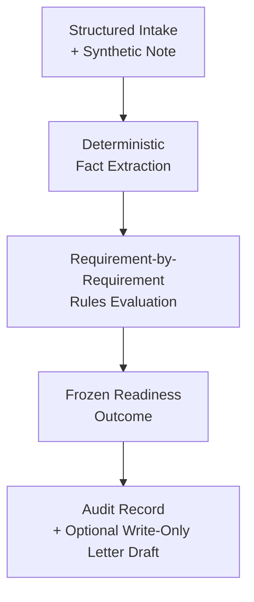

# Prior Authorization Readiness Copilot

A safety-first healthcare AI demo for deterministic prior authorization readiness review.

This repo is intentionally narrow: it checks whether a prior authorization request is administratively ready against documented payer criteria. It does not make clinical judgments, predict approval, or act autonomously.

<p align="center">
  
</p>
<p align="center"><em>Showcase result: a refusal-first <code>CANNOT_DETERMINE</code> CPAP review with blockers, requirement-level reasoning, extracted facts, evidence mapping, and audit traceability in one screen.</em></p>

## Start Here

| Open this first | Why it matters |
| --- | --- |
| [app.py](./app.py) | Demo surface: showcase cases, result hierarchy, audit summary, and write-only letter flow |
| [engine/extract.py](./engine/extract.py) | Deterministic fact extraction with evidence spans |
| [engine/evaluate.py](./engine/evaluate.py) | Requirement-by-requirement rules evaluation and frozen readiness logic |
| [rules/payer_rules.yaml](./rules/payer_rules.yaml) | Versioned payer criteria that drive the demo |
| [FAILURE_MODES.md](./FAILURE_MODES.md) and [MODEL_CARD.md](./MODEL_CARD.md) | Safety boundaries, intended use, and governance posture |

## Why This Matters
- Prior authorization requests are often delayed because required documentation is missing, incomplete, or misaligned with payer rules.
- Deterministic design matters here because readiness decisions should be reproducible, inspectable, and stable across reviewers.
- This is safer and more defensible than a generic LLM workflow because rules, refusal behavior, and outputs are explicit, auditable, and test-backed.

## At a Glance
- Type: deterministic administrative decision-support demo
- Domain: prior authorization readiness review
- Core behavior: structured intake, deterministic extraction, explicit rules evaluation, frozen readiness outcome
- Safety posture: refusal-first, rules-first, auditable, governance-aware
- Non-goals: clinical decision support, approval prediction, autonomous action

## System Snapshot



Versioned payer rules and provenance metadata drive each run. The system accepts structured intake plus note text, extracts a small set of span-evidenced facts, evaluates each requirement as `MET`, `NOT_MET`, or `NOT_DOCUMENTED`, and then produces a frozen readiness status, blocking items, audit output, and an optional write-only administrative letter.

## What This System Is / Is Not

| This system is | This system is not |
| --- | --- |
| Deterministic administrative decision support | Clinical decision support |
| A rules-first evaluator of documentation readiness | An approval prediction model |
| Refusal-first when required evidence is missing | A generic chatbot |
| A write-only drafting layer downstream of evaluated results | An autonomous submission or appeals agent |
| A governance-aware demo with policy drift monitoring | A system that infers missing facts or reinterprets policy with an LLM |

## Why It Is Credible
- Frozen readiness semantics: `READY`, `NOT_READY`, and `CANNOT_DETERMINE`
- Conservative extraction: missing facts stay missing
- Explicit refusal: any missing required element forces `CANNOT_DETERMINE`
- Constrained drafting: the letter layer cannot change facts, statuses, or approval likelihood
- Governed policy drift handling: changes trigger review, not silent rule updates
- Contract tests lock behavior across extraction, evaluation, drafting, and drift monitoring

## Safety, Refusal, and Governance

### Frozen readiness contract
- `MET`: documented and meets the threshold.
- `NOT_MET`: documented but below threshold.
- `NOT_DOCUMENTED`: not explicitly present in the note.

### Frozen overall outcomes
- `READY`: all required elements are documented and meet criteria.
- `NOT_READY`: all required elements are documented, but one or more do not meet criteria.
- `CANNOT_DETERMINE`: one or more required elements are not documented.

### Non-negotiable invariants
- Any `NOT_DOCUMENTED` must force `CANNOT_DETERMINE`.
- The system does not infer undocumented facts.
- Policy drift does not change rules automatically.
- The drafting layer cannot override evaluation outputs.

For the fuller safety narrative, see [FAILURE_MODES.md](./FAILURE_MODES.md), [docs/REFUSAL_IS_A_FEATURE.md](./docs/REFUSAL_IS_A_FEATURE.md), and [MODEL_CARD.md](./MODEL_CARD.md).

## Quick Demo

### Fastest way to explore this repo
1. Read [docs/DEMO_WALKTHROUGH.md](./docs/DEMO_WALKTHROUGH.md) for a short interview/demo script.
2. Run the app:

```bash
make install
make run
```

3. In the UI, look for:
- the policy provenance banner
- blocking items separated into missing documentation vs documented failures
- `CANNOT_DETERMINE` when required evidence is absent
- extracted facts and evidence mapping tied back to the note
- audit summary first, with raw audit JSON available lower in the page
- deterministic, write-only letter output with metadata

### Sanity check
```bash
make test
```

Manual setup also works with a local virtual environment and `pip install -r requirements.txt`.

## Additional Key Files
- [engine/letter_draft.py](./engine/letter_draft.py): write-only administrative letter generation
- [engine/policy_monitor.py](./engine/policy_monitor.py): policy drift snapshot, diff, and log handling
- [rules/provenance.yaml](./rules/provenance.yaml): trust framing for current rules
- [rules/policy_sources.yaml](./rules/policy_sources.yaml): monitored external policy sources
- [test/](./test): contract tests for deterministic and safety-critical behavior

## Scope and Limitations
- Uses synthetic/demo inputs, not production PHI workflows.
- Covers a narrow set of payer rules and extraction patterns.
- Does not integrate with an EHR, clearinghouse, or payer system.
- Policy drift monitoring is governance support, not automated policy interpretation.
- The UI is a demo surface; the repo’s strongest signal is the contracts, tests, and decision boundaries.

## Safe Expansion Path
- Expand rule coverage only with explicit provenance updates and regression tests.
- Add CI to run the contract suite automatically on each change.
- Add a small artifact example set for audit and governance reviewers.

## Recommended Reading Order
1. This README for scope, behavior, and run instructions.
2. [docs/DEMO_WALKTHROUGH.md](./docs/DEMO_WALKTHROUGH.md) for a fast portfolio/demo tour.
3. [FAILURE_MODES.md](./FAILURE_MODES.md) for the safety and governance posture.
4. [MODEL_CARD.md](./MODEL_CARD.md) for intended use and non-use.

## Supporting Docs
- [docs/DEMO_WALKTHROUGH.md](./docs/DEMO_WALKTHROUGH.md): fastest way to demo and explain the repo.
- [docs/LOCAL_WORKFLOW.md](./docs/LOCAL_WORKFLOW.md): local run/test workflow.
- [EXTRACTION_CONTRACT.md](./EXTRACTION_CONTRACT.md): extraction behavior contract.
- [LETTER_DRAFTING_CONTRACT.md](./LETTER_DRAFTING_CONTRACT.md): drafting constraints and safety boundaries.
- [PRD.md](./PRD.md): product framing and goals/non-goals.

Future changes should preserve the administrative scope, refusal-first behavior, deterministic evaluation, and explicit governance boundaries documented here.
