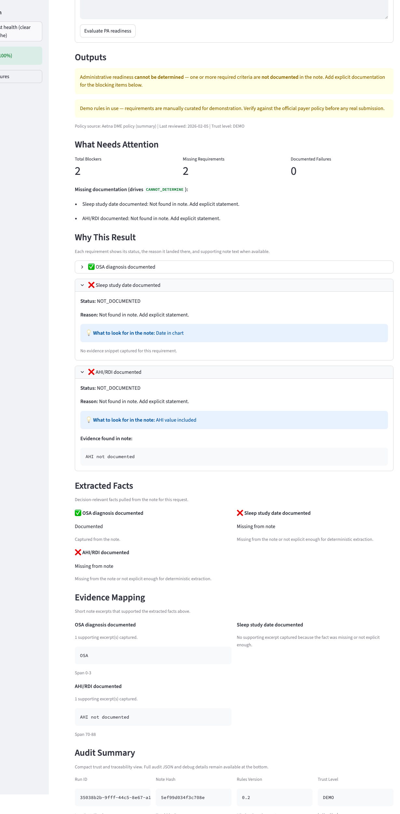

# Prior Authorization Readiness Copilot

Deterministic prior authorization readiness review for synthetic demo cases.

This repo checks whether a request is administratively ready against versioned payer rules. It does not make clinical judgments, predict approval, or act autonomously.

Current scope: the repo supports two Aetna demo procedures, `MRI_LUMBAR` and `CPAP_DEVICE`. Policy drift monitoring is configured only for `MRI_LUMBAR`.

<p align="center">
  
</p>

## Current Repo

- Deterministic extraction, evaluation, and letter drafting
- No LLM is used anywhere in the current implementation
- Synthetic inputs only
- Narrow rule coverage
- Streamlit demo UI plus pytest coverage

| Procedure | Supported in rules | Monitored for drift |
| --- | --- | --- |
| `MRI_LUMBAR` | Yes | Yes |
| `CPAP_DEVICE` | Yes | No |

Policy drift status applies only to configured monitored sources. In the current repo, runtime trust remains `demo` for both procedures because provenance is still curated offline in `rules/provenance.yaml`.

## Core Semantics

- `READY`: all required elements are documented and meet the current rule thresholds
- `NOT_READY`: all required elements are documented, but one or more do not meet threshold
- `CANNOT_DETERMINE`: one or more required elements are not documented

Any `NOT_DOCUMENTED` result must force `CANNOT_DETERMINE`.

## Limits

- Uses synthetic notes and demo rules
- Supports a small number of procedures and phrasing patterns
- Does not integrate with an EHR, payer, or clearinghouse
- Policy drift monitoring is partial and only covers configured sources

## Canonical Local Setup

Python version: `3.12.3`

```bash
python3.12 -m venv .venv
source .venv/bin/activate
python -m pip install --upgrade pip
python -m pip install -r requirements.txt
pytest -q
streamlit run app.py
```

CI runs `pytest -q`. That automated suite includes unit-style tests plus a regression check over the bundled synthetic eval cases. The UI separately surfaces the same bundled synthetic cases as a local demo gate.

## What To Inspect

- [app.py](./app.py): Streamlit demo surface and monitored-source policy panel
- [engine/extract.py](./engine/extract.py): deterministic extraction
- [engine/evaluate.py](./engine/evaluate.py): requirement evaluation and overall status logic
- [rules/payer_rules.yaml](./rules/payer_rules.yaml): current supported procedures
- [EXTRACTION_CONTRACT.md](./EXTRACTION_CONTRACT.md): extraction behavior as implemented
- [FAILURE_MODES.md](./FAILURE_MODES.md): safety and failure boundaries

## Possible Extensions

- Expand payer and procedure coverage with provenance updates and tests
- Add production integration layers outside this repo
- Evaluate whether optional LLM-assisted text formatting is worth adding behind strict contracts
