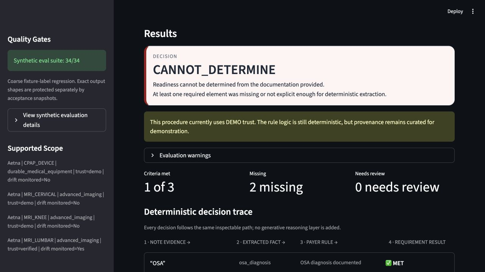

# Prior Authorization Readiness Copilot

Prior authorization often fails before medical necessity is even evaluated: missing documentation, unclear payer requirements, policy variation, rule drift, and handoff gaps between provider and payer teams.

This project is a deterministic readiness workflow that checks prior-authorization documentation against versioned payer rules before submission. It returns `READY`, `NOT_READY`, `CANNOT_DETERMINE`, or `NEEDS_REVIEW`, with evidence mapping, audit artifacts, and explicit refusal behavior when required information is missing or cannot be evaluated.

Its central design is an inspectable `note evidence → extracted fact → rule/operator → requirement result → overall decision` trace. One `Aetna:MRI_LUMBAR` pathway demonstrates verified official-policy provenance; the cervical MRI, knee MRI, and CPAP pathways remain synthetic demos.

It is a self-directed prototype, not a production payer integration or clinical decision system. The goal is to show how prior-auth workflows can be made more reviewable, auditable, and implementation-aware.



_Synthetic CPAP demo case. The workflow refuses to infer a missing sleep-study date or AHI/RDI value and surfaces both documentation gaps for review._

## Read This First

This is a synthetic workflow-readiness demo, not a payer or clinical deployment.

- Bundled inputs are synthetic, and free-form input is intended for synthetic demo text; input text is not screened, so do not submit real patient information.
- Outputs are administrative readiness signals under narrow versioned rules. One lumbar-MRI pathway is mapped to an official Aetna policy; the remaining pathways are synthetic demonstrations.
- `READY` means the configured requirement documentation was found and met threshold. It is never an authorization or medical-necessity determination.
- `NOT_READY` means required documentation was found and evaluable, but failed a threshold.
- `CANNOT_DETERMINE` means required documentation is missing or not explicit enough.
- `NEEDS_REVIEW` means documentation was found but at least one result was ambiguous, contradictory, or not safely evaluable; it is not an adjudicated threshold failure.
- `submission_readiness=true` additionally requires current verified policy provenance, a trusted active rulebook, and no unresolved drift. A documentation result may remain `READY` while submission readiness is false.
- No output means payer approval, denial prediction, medical necessity, clinical appropriateness, or medical advice.

## Quick Reviewer Path

From a fresh clone, enter the repo and run:

```bash
make install PYTHON=python3.12
make reviewer-demo
make acceptance
```

The `make reviewer-demo` target runs a deterministic local path through:

- service status and supported scope
- bundled synthetic demo cases
- one `READY` case: `MRI-01-complete`
- one documented threshold failure: `MRI-08-edge-below-threshold`
- one refusal-first missing-information case: `CPAP-02-borderline`
- one exported JSON artifact at `/tmp/pa-copilot-reviewer-demo.json`

Then inspect the checked-in sample artifacts:

- [docs/artifacts/MRI-01-complete.json](docs/artifacts/MRI-01-complete.json)
- [docs/artifacts/MRI-08-edge-below-threshold.json](docs/artifacts/MRI-08-edge-below-threshold.json)
- [docs/artifacts/CPAP-02-borderline.json](docs/artifacts/CPAP-02-borderline.json)

For a guided review of inputs, evidence mapping, missing-information flags, output meaning, human review, governance, and enterprise gaps, start with [docs/reviewer_guide.md](docs/reviewer_guide.md).

## What This Repo Does

- extracts a narrow set of required facts from demo note text using deterministic rules
- evaluates those facts against versioned payer requirements
- returns requirement-level reasoning, blocker summaries, evidence mapping, and audit trace data
- exposes the same workflow through Streamlit, FastAPI, and a CLI
- monitors configured policy sources for drift without auto-changing rules or outcomes

## What This Repo Does Not Do

- no approval prediction
- no clinical decision support
- no claims adjudication
- no medical-necessity review
- no autonomous submission or outreach
- no real payer integrations
- no production or compliance claims

## How The Readiness Logic Works

At a high level:

1. A bundled synthetic or user-entered demo request enters through Streamlit, FastAPI, CLI, or artifact generation.
2. `engine/extract.py` deterministically extracts only supported facts and evidence spans from note text.
3. `rules/payer_rules.yaml` defines which facts are required for each supported payer/procedure pair.
4. `engine/evaluate.py` applies frozen status semantics:
   - any `NOT_DOCUMENTED` requirement forces `CANNOT_DETERMINE`
   - otherwise any `NEEDS_REVIEW` requirement forces `NEEDS_REVIEW`
   - otherwise any `NOT_MET` requirement forces `NOT_READY`
   - only all `MET` requirements return `READY`
5. `engine/service.py` assembles blockers, facts, evidence maps, provenance, warnings, audit trace data, and standard output payloads.

Human review remains outside the automation boundary. A real workflow would still require policy interpretation, chart review, escalation handling, final submission decisions, PHI controls, auth, audit operations, and payer integration layers that are intentionally not implemented here.

## Why Deterministic First

This problem is intentionally narrow. Deterministic logic is the right backbone because it is:

- explainable requirement by requirement
- explicit about rule operators and fail-closed status semantics
- auditable with stable evidence references
- safe to refuse when documentation is missing
- testable with synthetic fixtures and regression cases
- payer-qualified in rule identity and procedure-scoped in policy trust
- versioned through immutable rule releases with policy provenance and drift signals
- reproducible through adversarial extraction tests and generated artifacts

`CANNOT_DETERMINE` is a feature here, not a failure mode.

The bundled labeled fixture currently contains 52 synthetic cases. Its regression snapshot is 52/52 exact overall statuses, 0 false `READY` results among 45 expected non-`READY` cases, 12 `NEEDS_REVIEW` results (23.1%), and 42 combined `NEEDS_REVIEW`/`CANNOT_DETERMINE` abstentions (80.8%). These figures describe only the checked-in fixture; they are not estimates of performance on clinical notes or external data.

## Current Supported Scope

| Payer | Procedure | Policy trust | Drift monitored |
| --- | --- | --- | --- |
| Aetna | `MRI_LUMBAR` | Verified for one CPB 0236 radiculopathy branch | Yes |
| Aetna | `MRI_CERVICAL` | Synthetic/demo | No |
| Aetna | `MRI_KNEE` | Synthetic/demo | No |
| Aetna | `CPAP_DEVICE` | Synthetic/demo | No |

`MRI_LUMBAR` implements only the persistent back pain with radiculopathy alternative in official [Aetna Clinical Policy Bulletin 0236](https://www.aetna.com/cpb/medical/data/200_299/0236.html), _Magnetic Resonance Imaging (MRI) and Computed Tomography (CT) of the Spine_. The source was last reviewed April 9, 2026 and accessed August 22, 2026. The implemented branch requires back pain with radiculopathy, objective motor/reflex findings in an explicit nerve-root distribution, at least six weeks of qualifying conservative therapy, and explicit lack of improvement. Other CPB 0236 indications are not modeled.

Footnote 1 identifies moderate activity, analgesics, NSAIDs/anti-inflammatory medication, and muscle relaxants as conservative-therapy modalities, but it does not explicitly say that every modality, a specific combination, or only one modality is required. The prototype interprets a documented qualifying modality as sufficient evidence of therapy type. For a duration and response to satisfy the implemented branch together, they must resolve to one unambiguous supported modality candidate; contrast clauses, conflicting candidates, and unsupported cross-modality linkage route to review. This is a bounded deterministic interpretation, not quoted Aetna policy language or general episode resolution.

The verified provenance chain is `official source → validated normalized snapshot/hash → requirement-to-clause mapping → structured rule → extracted evidence → deterministic evaluation`. Snapshot structure, source identity, stored content, recomputed hash, timestamps, freshness, and unresolved drift are checked before trust can remain verified. Invalid state downgrades only the affected payer/procedure to demo and forces `submission_readiness=false`; this is still local prototype governance, not production policy management.

Bundled inputs remain synthetic; free-form input is not screened and must not contain real patient information. Policy drift monitoring is governance-only and does not automatically update rules. The rulebook registry tracks reviewed and active snapshots separately from runtime drift monitoring.

## Architecture At A Glance

- `engine/extract.py`: deterministic extraction
- `engine/evaluate.py`: requirement evaluation and frozen status semantics
- `engine/letter_draft.py`: write-only administrative letter drafting
- `engine/service.py`: shared orchestration for UI, API, CLI, and artifacts
- `engine/policy_monitor.py`: governance-only drift detection and snapshot handling
- `engine/rulebook.py`: versioned rulebook validation and diffing
- `engine/acceptance.py`: golden-output normalization for acceptance checks
- `app.py`: Streamlit operator demo
- `api.py`: FastAPI surface
- `cli.py`: local demo and export workflows

More detail: [docs/architecture.md](docs/architecture.md)

## Local Setup

Python version used in this repo: `3.12.x` (`.python-version` pins `3.12.3`).

```bash
make install PYTHON=python3.12
make test
make lint
make acceptance
make smoke-ui
make verify
make run
```

If you prefer direct commands:

```bash
python3.12 -m venv .venv
.venv/bin/python -m pip install -r requirements.txt
.venv/bin/python -m pytest -q
.venv/bin/python -m pytest -q test/test_acceptance_snapshots.py
.venv/bin/python -m ruff check .
.venv/bin/python -m pytest -q test/test_streamlit_app.py
.venv/bin/python -m scripts.generate_artifacts
.venv/bin/python -m scripts.generate_golden_outputs
.venv/bin/python -m streamlit run app.py
```

## FastAPI

Run locally:

```bash
make api
```

Direct equivalent: `.venv/bin/python -m uvicorn api:app --reload`

Example calls:

```bash
curl http://127.0.0.1:8000/health
curl http://127.0.0.1:8000/supported-procedures
curl http://127.0.0.1:8000/demo-cases
curl -X POST http://127.0.0.1:8000/evaluate \
  -H "Content-Type: application/json" \
  -d '{
    "payer": "Aetna",
    "procedure_code": "MRI_LUMBAR",
    "dx_codes": ["M54.16"],
    "site_of_care": "outpatient",
    "specialty": "Orthopedics",
    "note_text": "Low back pain with right leg radiculopathy. NSAIDs for 8 weeks with minimal improvement. Objective motor exam in the right L5 distribution: ankle dorsiflexion strength 4/5."
  }'
```

Full API notes: [docs/api.md](docs/api.md)

## CLI

```bash
.venv/bin/python cli.py status
.venv/bin/python cli.py list-procedures
.venv/bin/python cli.py list-demo-cases
.venv/bin/python cli.py evaluate --demo-case MRI-01-complete
.venv/bin/python cli.py evaluate --demo-case MRI-CERV-01-ready
.venv/bin/python cli.py evaluate --demo-case MRI-KNEE-01-ready
.venv/bin/python cli.py evaluate --demo-case CPAP-02-borderline
.venv/bin/python cli.py export-report --demo-case CPAP-02-borderline --output /tmp/pa-copilot-reviewer-demo.json --with-letter --letter-type missing_info_request
.venv/bin/python cli.py drift-status
.venv/bin/python cli.py rulebook-status
.venv/bin/python cli.py rulebook-diff --from-release 2026-04-09-reviewed-v0.4 --to-release 2026-08-22-active-v1.0
```

## Demo Artifacts

Stable sample outputs are generated under [docs/artifacts](docs/artifacts).
Volatile run IDs, timestamps, letter hashes, and freshness ages are normalized so regeneration stays reviewable.
See [docs/artifacts/README.md](docs/artifacts/README.md) for how to inspect these artifacts.

- [MRI-01-complete.json](docs/artifacts/MRI-01-complete.json)
- [MRI-08-edge-below-threshold.json](docs/artifacts/MRI-08-edge-below-threshold.json)
- [MRI-CERV-01-ready.json](docs/artifacts/MRI-CERV-01-ready.json)
- [MRI-KNEE-01-ready.json](docs/artifacts/MRI-KNEE-01-ready.json)
- [CPAP-02-borderline.json](docs/artifacts/CPAP-02-borderline.json)
- [drift_status.json](docs/artifacts/drift_status.json)
- [drift_report.md](docs/artifacts/drift_report.md)
- [featured_demo_cases.json](docs/artifacts/featured_demo_cases.json)
- [rulebook_status.json](docs/artifacts/rulebook_status.json)
- [rulebook_diff_reviewed_vs_active.json](docs/artifacts/rulebook_diff_reviewed_vs_active.json)
- [rulebook_diff_reviewed_vs_active.md](docs/artifacts/rulebook_diff_reviewed_vs_active.md)
- [status.json](docs/artifacts/status.json)
- [safety_metrics.json](docs/artifacts/safety_metrics.json)

Regenerate demo artifacts with:

```bash
.venv/bin/python -m scripts.generate_artifacts
```

Regenerate golden acceptance snapshots with:

```bash
.venv/bin/python -m scripts.generate_golden_outputs
```

## Key Docs

- [docs/architecture.md](docs/architecture.md)
- [docs/api.md](docs/api.md)
- [docs/demo_walkthrough.md](docs/demo_walkthrough.md)
- [docs/reviewer_guide.md](docs/reviewer_guide.md)
- [docs/testing.md](docs/testing.md)
- [docs/safety_and_scope.md](docs/safety_and_scope.md)
- [EXTRACTION_CONTRACT.md](EXTRACTION_CONTRACT.md)
- [LETTER_DRAFTING_CONTRACT.md](LETTER_DRAFTING_CONTRACT.md)
- [MODEL_CARD.md](MODEL_CARD.md)
- [FAILURE_MODES.md](FAILURE_MODES.md)
- [PRODUCT_OVERVIEW.md](PRODUCT_OVERVIEW.md)
- [WHY_THIS_EXISTS.md](WHY_THIS_EXISTS.md)
- [DESIGN_DECISIONS.md](DESIGN_DECISIONS.md)
- [LIMITATIONS.md](LIMITATIONS.md)
- [NEXT_STEPS.md](NEXT_STEPS.md)

## Repo Quality Gates

- deterministic-only evaluation path
- synthetic fixtures only
- pytest regression coverage
- acceptance snapshots for representative product outputs
- structured outputs shared across UI, API, CLI, and exported artifacts
- explicit unsupported-scope handling
- honest scope and safety language
